# ClearBoard / Task Manager

---

**Автор:** Екатерина Зубарева  
**Группа:** P3468
**Дата:** 2026  
**Название работы:** Разработка SPA-приложения на Vue 3 с сервером на Python

**Ссылка на репозиторий:** https://github.com/KatyaZubareva/task-manager

---

## Цель работы

Освоить фундаментальные возможности Vue 3: привязка данных, события, computed, watch, формы и модификаторы ввода, условный рендеринг, вывод массивов, сортировка, фильтрация, компоненты, props, события, слоты, маршрутизация Vue Router, работа с refs и жизненным циклом, научиться взаимодействовать с сервером (REST API), освоить базовую серверную разработку на Python (FastAPI), освоить контейнеризацию приложения (Docker) и научиться структурировать отчёт по проекту.

---

## Описание проекта

**ClearBoard** — это веб-сервис для управления задачами, разработанный с использованием современных технологий фронтенда и бэкенда. Проект предоставляет интуитивно понятный интерфейс для создания, отслеживания и управления задачами, с акцентом на продуктивность и удобство пользователя.

---

## Функционал

- Регистрация и вход пользователей
- Добавление новых задач с описанием
- Отслеживание статуса задач (Pending, In Progress, Review, Blocked, Done)
- Пометка задач как выполненных или удаление
- Адаптивная главная страница с call-to-action
- Cookie-баннер с согласиями (UI/UX compliant)
- В будущем: интеграция AI для автоматизации управления задачами

---

## Стек технологий

**Фронтенд:**
- Vue.js 3 + Vue Router
- HTML5 / CSS3 / SCSS
- Адаптивный дизайн и UX-оптимизация

**Бэкенд:**
- Python + Flask/FastAPI
- REST API для работы с задачами

**База данных:**
- SQLite

**Инструменты:**
- Git + GitHub для контроля версий
- Vite для сборки фронтенда
- npm для управления зависимостями

---

## Установка и запуск

### Клонирование репозитория:
```bash
git clone https://github.com/KatyaZubareva/task-manager.git
cd task-manager
```

### Запуск через Docker:

1. **Сборка и запуск контейнеров:**
```bash
docker compose build
docker compose up
```

2. **Доступ к приложению:**
- Frontend: http://localhost
- Backend API: http://localhost:8000
- API документация: http://localhost:8000/docs

3. **Остановка:**
```bash
docker compose down
```

### Локальный запуск (без Docker):

**Backend:**
```bash
cd backend
python -m venv venv
source venv/bin/activate  # Windows: venv\Scripts\activate
pip install -r requirements.txt
uvicorn main:app --reload
```

**Frontend:**
```bash
cd frontend
npm install
npm run dev
```

---

## Реализованный функционал

### Компоненты

Созданы следующие компоненты:

1. **TaskItem.vue** — отображение одной задачи
   - Принимает props: `task` (объект задачи)
   - Использует `computed` для вычисления статуса задачи
   - Эмитит события: `delete`, `toggle`, `edit`
   - Условный рендеринг статуса задачи

2. **TaskForm.vue** — форма создания/редактирования задачи
   - Поддерживает режимы создания и редактирования
   - Поля формы:
     - Заголовок (input с модификатором `trim`)
     - Описание (textarea с модификатором `trim`)
     - Приоритет (select: low, medium, high)
     - Категория (radio: work, personal, general)
     - Важно (checkbox)
   - Валидация через HTML5 атрибут `required`
   - Использует `v-model` для двусторонней привязки данных

3. **LayoutCard.vue** — компонент с использованием слотов
   - Обычный слот (default)
   - Именованные слоты: `header`, `content`, `footer`
   - Слот с ограниченной областью видимости (scoped slot) в `footer` с передачей данных `message` и `count`

4. **AppFooter.vue** — нижняя панель приложения
   - Использует Vue Router для навигации
   - Адаптивный дизайн

5. **AppHeader** (в App.vue) — верхнее меню
   - Навигация по приложению
   - Условный рендеринг ссылок на основе аутентификации
   - Cookie-баннер с использованием `vue3-cookies`

### Computed и Watch

**Computed свойства:**
- В `TaskItem.vue`: `statusText` и `statusClass` — вычисляют текст и класс статуса задачи
- В `App.vue`: `tasksLink` — вычисляет ссылку на страницу задач в зависимости от аутентификации
- В `TasksWorkspace.vue`: 
  - `filteredTasks` — фильтрует задачи по статусу
  - `filteredAndSortedTasks` — фильтрует и сортирует задачи

**Watch:**
- Используется неявно через реактивность Vue 3 (ref, computed)

### Слоты

Слоты реализованы в компоненте **LayoutCard.vue**:
- **Обычный слот (default)**: используется для основного контента
- **Именованные слоты**: `header`, `content`, `footer`
- **Scoped slot**: в слоте `footer` передаются данные `message` и `count` для использования в родительском компоненте

Пример использования:
```vue
<LayoutCard>
  <template #header>
    <h2>Custom Header</h2>
  </template>
  <template #content>
    <p>Custom content</p>
  </template>
  <template #footer="{ message, count }">
    <p>{{ message }} - Count: {{ count }}</p>
  </template>
</LayoutCard>
```

### Маршрутизация

Реализованы следующие маршруты:

1. `/` — главная страница (Home)
2. `/tasks` — страница с календарем задач
3. `/tasks/workspace` — страница списка задач с фильтрацией и сортировкой
4. `/tasks/new` — создание новой задачи (именованный маршрут `TaskNew`)
5. `/tasks/:id/edit` — редактирование задачи (именованный маршрут `TaskEdit`)
6. `/register` — регистрация пользователя
7. `/login` — вход в систему
8. `/profile` — профиль пользователя
9. `/subscription` — страница подписки
10. `/:pathMatch(.*)*` — страница 404 (NotFound)

**Особенности:**
- Использованы именованные маршруты
- Динамические параметры маршрута (`:id`)
- Программная навигация через `useRouter()` и `router.push()`
- Страница 404 для несуществующих маршрутов

### Серверная часть

**Backend на FastAPI:**

1. **CRUD-методы:**
   - `GET /api/tasks` — получение всех задач пользователя
   - `GET /api/tasks/{id}` — получение задачи по ID
   - `POST /api/tasks` — создание новой задачи
   - `PUT /api/tasks/{id}` — обновление задачи
   - `DELETE /api/tasks/{id}` — удаление задачи

2. **Аутентификация:**
   - `POST /register` — регистрация пользователя
   - `POST /token` — получение JWT токена

3. **Хранение данных:**
   - SQLite база данных (`database.db`)
   - Модели: `User`, `Task`
   - Автоматическое создание таблиц при запуске

4. **Модель Task:**
   - `id` — уникальный идентификатор
   - `title` — заголовок задачи
   - `description` — описание задачи
   - `completed` — статус выполнения
   - `priority` — приоритет (low, medium, high)
   - `category` — категория (work, personal, general)
   - `important` — флаг важности
   - `created_at` — дата создания
   - `user_id` — связь с пользователем

5. **Безопасность:**
   - JWT токены для аутентификации
   - Проверка прав доступа к задачам (пользователь может работать только со своими задачами)
   - CORS настройки для работы с фронтендом

---

## Скриншоты интерфейса

1. **Главная страница** (`/`) — приветственный экран с кнопкой "Go to tasks"

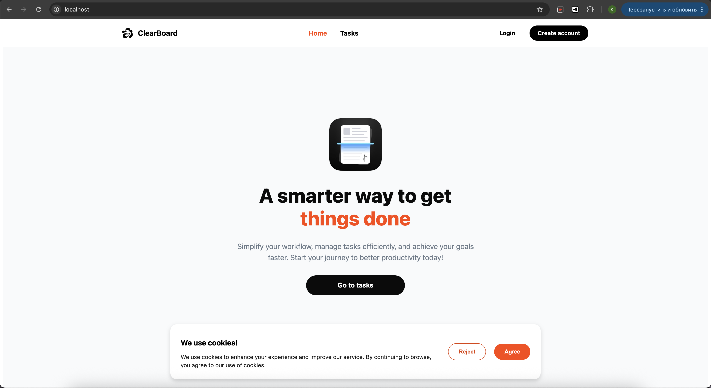
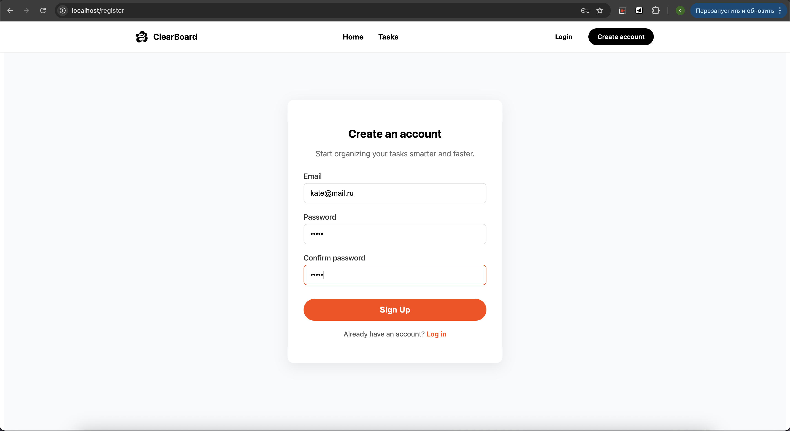
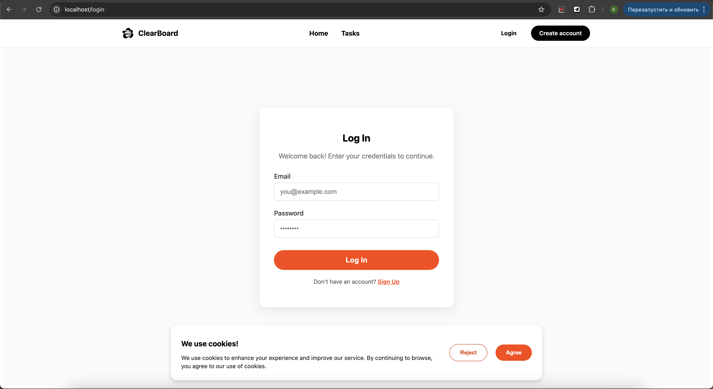
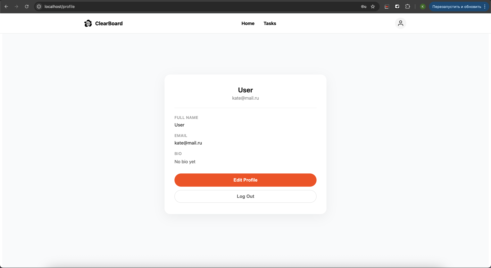

2. **Список задач** (`/tasks/workspace`) — отображение задач с фильтрами и сортировкой

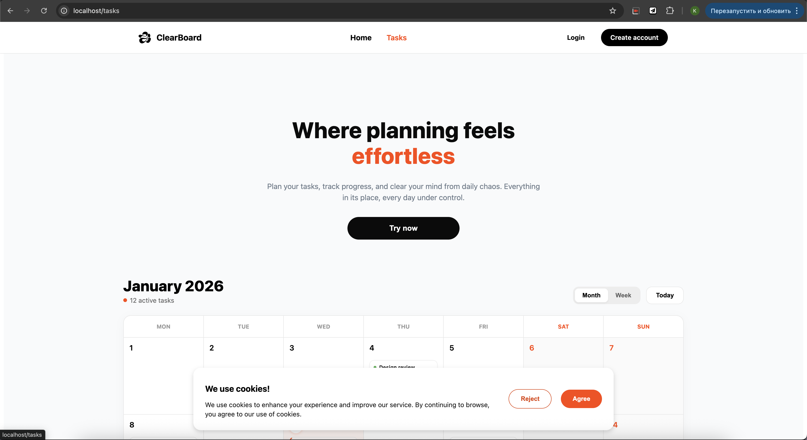
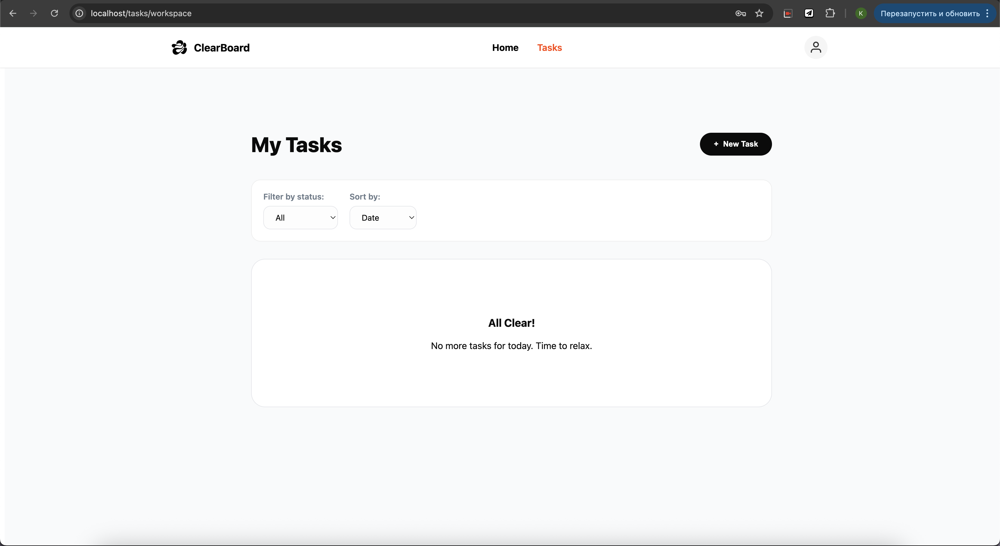
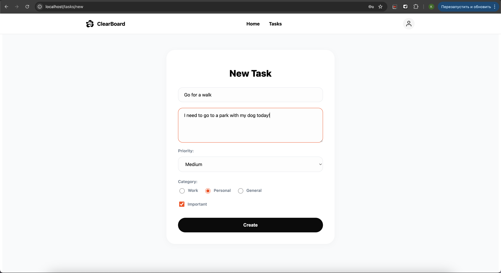
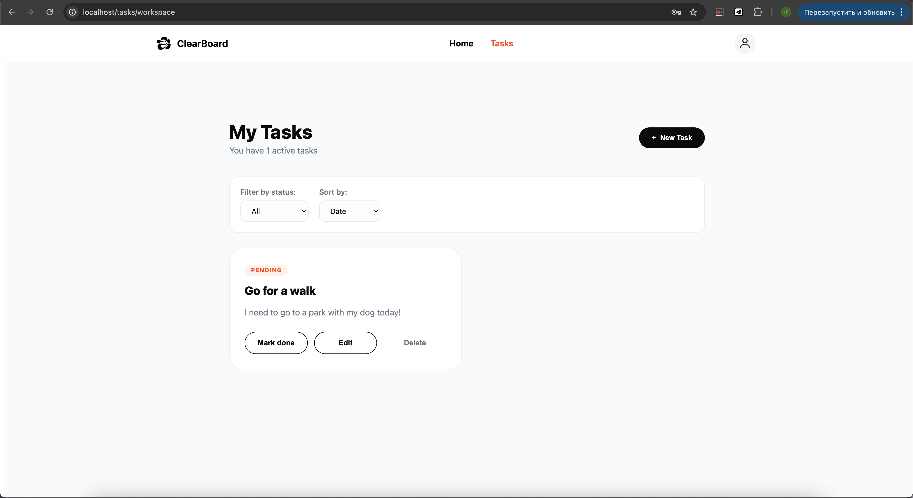

3. **Фильтрация/сортировка** — демонстрация работы фильтров по статусу и сортировки по дате/алфавиту

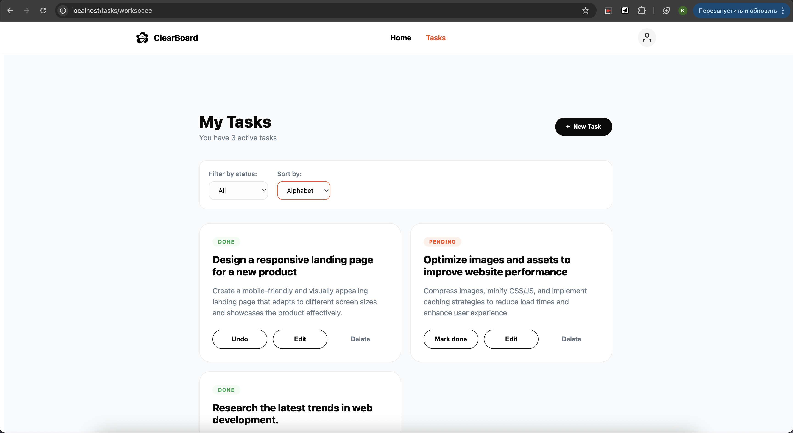
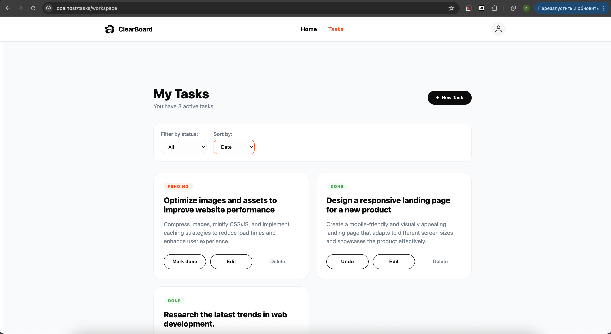
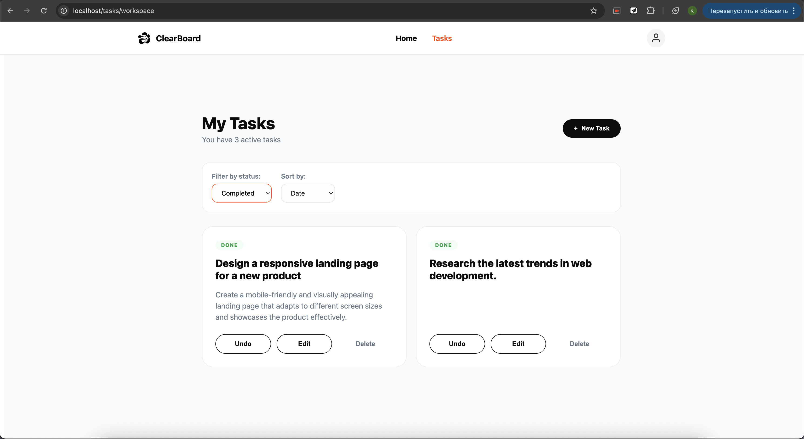
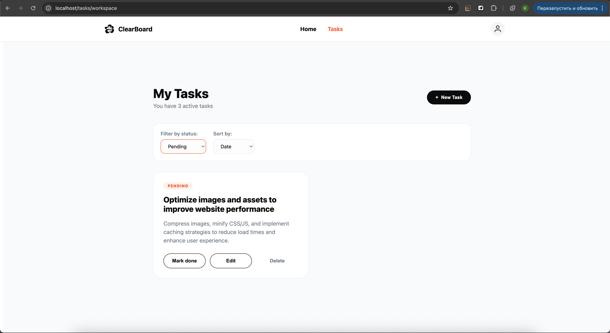

4. **Форма создания** (`/tasks/new`) — форма с полями: заголовок, описание, приоритет, категория, важно


5. **Форма редактирования** (`/tasks/:id/edit`) — та же форма, но с заполненными данными

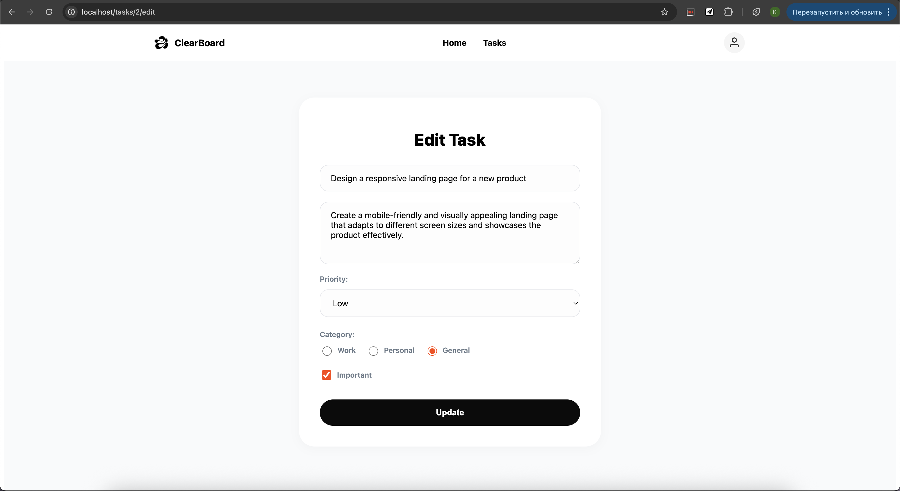

6. **Страница 404** — отображение страницы для несуществующих маршрутов

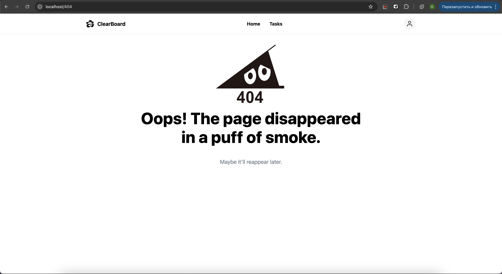

---

## Пример кода

### Использование computed для фильтрации и сортировки

```vue
<script setup>
import { ref, computed } from 'vue'

const tasks = ref([])
const statusFilter = ref('all')
const sortBy = ref('date')

const filteredTasks = computed(() => {
  if (statusFilter.value === 'all') return tasks.value
  if (statusFilter.value === 'completed') return tasks.value.filter(t => t.completed)
  return tasks.value.filter(t => !t.completed)
})

const filteredAndSortedTasks = computed(() => {
  const filtered = [...filteredTasks.value]
  
  if (sortBy.value === 'alphabet') {
    return filtered.sort((a, b) => a.title.localeCompare(b.title))
  }
  
  return filtered.sort((a, b) => {
    const dateA = a.created_at ? new Date(a.created_at) : new Date(0)
    const dateB = b.created_at ? new Date(b.created_at) : new Date(0)
    return dateB - dateA
  })
})
</script>
```

### Использование компонента TaskItem с событиями

```vue
<template>
  <TaskItem
    v-for="task in filteredAndSortedTasks"
    :key="task.id"
    :task="task"
    @delete="deleteTask"
    @toggle="toggleTask"
    @edit="editTask"
  />
</template>
```

### Использование v-model с модификаторами

```vue
<template>
  <form @submit.prevent="submitTask">
    <input v-model.trim="title" placeholder="Title" required />
    <textarea v-model.trim="description" placeholder="Description"></textarea>
    
    <select v-model="priority">
      <option value="low">Low</option>
      <option value="medium">Medium</option>
      <option value="high">High</option>
    </select>
    
    <label>
      <input type="radio" v-model="category" value="work" />
      Work
    </label>
    
    <label>
      <input type="checkbox" v-model="important" />
      Important
    </label>
  </form>
</template>
```

### Условный рендеринг

```vue
<template>
  <div v-if="tasks.length === 0" class="empty-state">
    <h3>All Clear!</h3>
    <p>No more tasks for today. Time to relax.</p>
  </div>
  
  <div v-else class="task-grid">
    <TaskItem
      v-for="task in tasks"
      :key="task.id"
      :task="task"
    />
  </div>
</template>
```

### Программная навигация

```vue
<script setup>
import { useRouter } from 'vue-router'

const router = useRouter()

const editTask = (task) => {
  router.push(`/tasks/${task.id}/edit`)
}

const createTask = async () => {
  // ... создание задачи
  router.push('/tasks/workspace')
}
</script>
```

### Использование слотов

```vue
<!-- LayoutCard.vue -->
<template>
  <div class="layout-card">
    <slot name="header">
      <h2>Default Header</h2>
    </slot>
    
    <slot name="content">
      <p>Default content</p>
    </slot>
    
    <slot name="footer" :message="footerMessage" :count="itemCount">
      <p>Default footer: {{ footerMessage }}</p>
    </slot>
  </div>
</template>
```

---

## JSON или SQLite данные

### Структура базы данных

База данных SQLite содержит две таблицы:

**Таблица User:**
- `id` (INTEGER, PRIMARY KEY)
- `email` (TEXT, UNIQUE, INDEXED)
- `password` (TEXT)

**Таблица Task:**
- `id` (INTEGER, PRIMARY KEY)
- `title` (TEXT)
- `description` (TEXT)
- `completed` (BOOLEAN, DEFAULT FALSE)
- `priority` (TEXT, DEFAULT 'medium')
- `category` (TEXT, DEFAULT 'general')
- `important` (BOOLEAN, DEFAULT FALSE)
- `created_at` (TEXT)
- `user_id` (INTEGER, FOREIGN KEY -> User.id)

### Пример данных задачи (JSON формат)

```json
[
  {
    "id": 1,
    "title": "Создать Vue-компонент",
    "description": "Разработать компонент TaskItem с использованием props и events",
    "completed": false,
    "priority": "high",
    "category": "work",
    "important": true,
    "created_at": "2026-01-15T10:30:00",
    "user_id": 1
  },
  {
    "id": 2,
    "title": "Написать отчет",
    "description": "Подготовить отчет по выполнению практического задания",
    "completed": false,
    "priority": "medium",
    "category": "general",
    "important": false,
    "created_at": "2026-01-15T11:00:00",
    "user_id": 1
  },
  {
    "id": 3,
    "title": "Изучить Docker",
    "description": "Освоить контейнеризацию приложений",
    "completed": true,
    "priority": "low",
    "category": "personal",
    "important": false,
    "created_at": "2026-01-14T09:00:00",
    "user_id": 1
  }
]
```

---

## Инструкция по запуску (Docker)

### Требования

- Docker и Docker Compose установлены на системе
- Git для клонирования репозитория

### Запуск приложения

1. **Клонирование репозитория:**
```bash
git clone https://github.com/KatyaZubareva/task-manager.git
cd task-manager
```

2. **Сборка и запуск контейнеров:**
```bash
docker compose build
docker compose up
```

3. **Доступ к приложению:**
- Frontend: http://localhost
- Backend API: http://localhost:8000
- API документация: http://localhost:8000/docs

### Остановка приложения

```bash
docker compose down
```

### Пересборка после изменений

```bash
docker compose down
docker compose build --no-cache
docker compose up
```

### Структура Docker

**Frontend (Nginx):**
- Сборка Vue приложения через Node.js
- Раздача статических файлов через Nginx
- Проксирование API запросов на backend

**Backend (Python/FastAPI):**
- Запуск FastAPI приложения через Uvicorn
- Подключение к SQLite базе данных
- Том для сохранения данных базы данных

**Volumes:**
- `./backend/database.db` — база данных SQLite (сохраняется между перезапусками)

---

## Выводы

В ходе выполнения практического задания были освоены ключевые возможности Vue 3, включая Composition API, реактивные переменные, computed свойства, двустороннюю привязку через v-model и модификаторы. Реализован компонентный подход с переиспользуемыми компонентами, слотами, props и событиями, а также настроена маршрутизация через Vue Router с динамическими маршрутами и страницей 404. Освоена работа с формами, включая различные типы полей, валидацию и обработку событий, а также взаимодействие с REST API с использованием CRUD операций и JWT-аутентификации. Произведена контейнеризация приложения с помощью Docker и docker-compose, включая многоэтапную сборку и использование томов для сохранения данных. Организована структура SPA-проекта с адаптивным дизайном, применены TransitionGroup и жизненный цикл компонентов, настроена работа с cookies. На серверной стороне освоен FastAPI, реализованы модели и endpoints для работы с SQLite, а также обеспечена безопасность и CORS. В результате сформированы прочные навыки разработки полнофункционального веб-приложения с современным стеком технологий.

---

**Дата создания отчета:** 2026  
**Версия проекта:** 1.0.0
